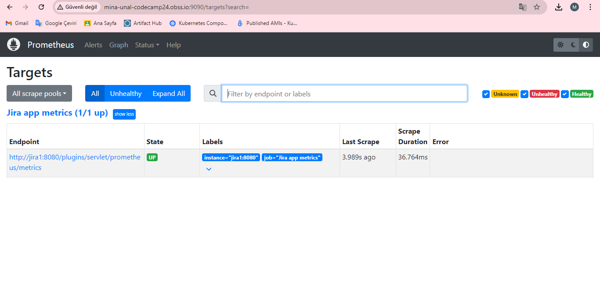
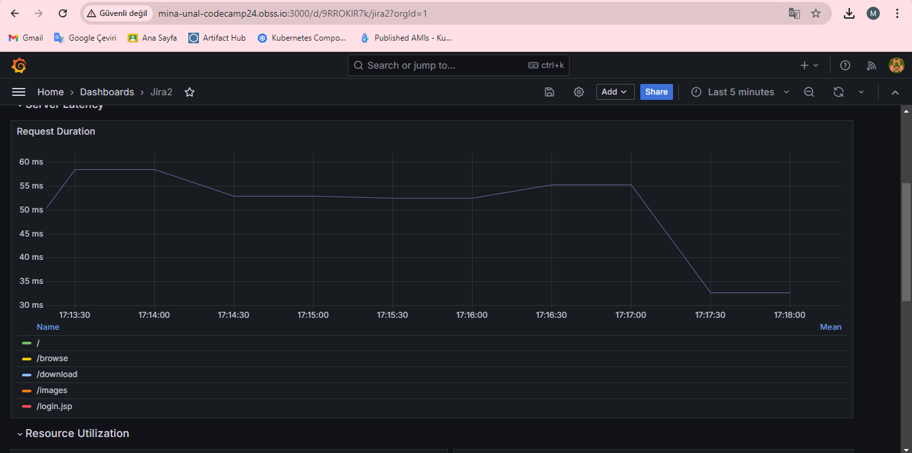
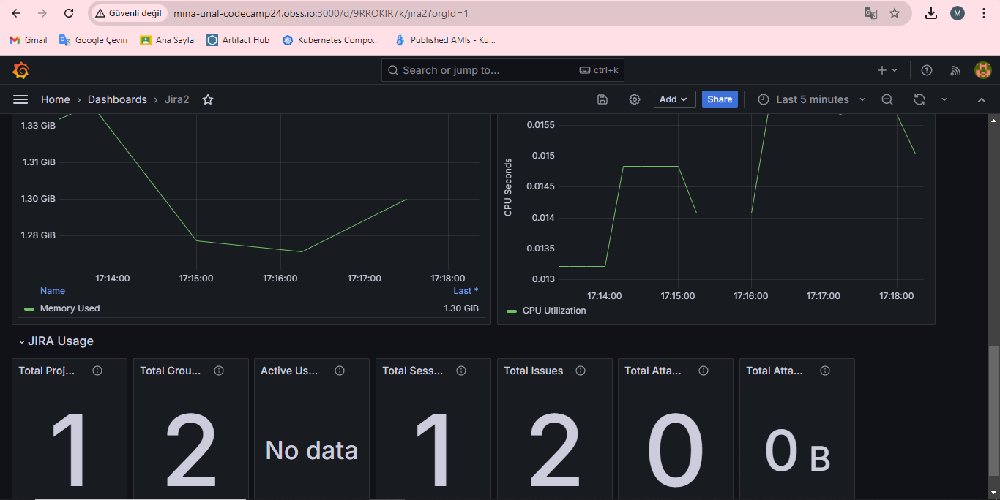

Grafana monitoring by using Prometheus connection has made within the scope of the project.
When creating some issues on Jira, grafana is showing this data on dashboard. Related images are below: 
 
 
 
